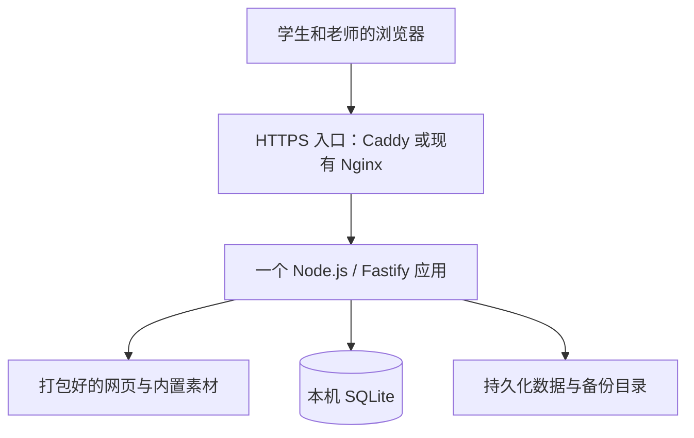

# 首版设计｜小规模关卡创作与同伴反馈

> 2026-09-27更新：本文保留首版设计。用户随后授权的横版跳跃／探索故事升级，当前范围、行为和验证以[双玩法里程碑](../task_plan/dual-games/02-milestones.md)及各阶段契约为准；仍是单Fastify＋SQLite，新玩法使用Phaser 3，旧网格作品兼容。使用方式见[工坊指南](../usage/01-creative-workshop.md)。


- 日期：2026-09-26
- 项目：`magic_creater_test`
- 状态：首版已实现、验证并在11700内部部署，M1验收通过；用户2026-09-26明确异机备份延后。
- 当前架构依据：[ADR 0002](../decisions/0002-small-scale-web-app.md)与[实现决定ADR 0003](../decisions/0003-first-implementation.md)。本页是首版设计入口；早期技术研究与本页不一致时，以本页和 ADR 0002 为准。
- 确认范围：小规模使用、避免过度设计、可从开发机迁到 ECS、先完成一种玩法及多个作品。
- 未确认：首批学生年龄与具体困难、合作学校、实际设备、正式发行渠道。早期研究中的 12–15 岁是估算假设，不是已确认需求。

## 1. 产品目标与边界

首版定位为**带关卡编辑器和班级作品库的创作游戏**。核心体验是：

> 从模板开始 → 自主修改 → 立即试玩 → 提交给老师 → 同伴体验并回应 → 再次修改。

希望验证学生是否能完成创作、是否愿意继续修改、是否得到具体反馈，以及老师能否组织活动。在线时长、作品数量或通关率不能直接证明改善厌学；已有研究的适用边界见 [干预研究](../research/01-interventions.md)。

### 首版范围

| 能力 | 首版设计 |
|---|---|
| 玩法 | 一种俯视角网格探索玩法；初始目标为收集物品并抵达终点 |
| 创作 | 内置模板；放置/移除起点、终点、墙、收集物；修改作品名称 |
| 编辑操作 | 点击放置为基础，桌面可增加拖放；撤销/重做；编辑与试玩切换 |
| 作品保存 | 浏览器本地草稿、服务端保存、复制作品、文件导入/导出 |
| 分享 | 班级作品列表；老师确认一个固定版本后展示；可撤回 |
| 反馈 | 简单文字提示引导具体反馈；作者查看反馈并修改 |
| 角色 | 学生、老师两种固定角色；初始部署以一个班级空间为主 |
| 运维 | 单个应用实例、本地数据目录、备份恢复、基本错误日志 |

首版采用预定义玩法和少量可配置属性。门、钥匙、开关等机制只有在基础创作闭环需要时再增加；本轮不建设通用规则解释器。

### 后续再考虑

Blockly 积木编程、多玩法编辑器、任意代码、自定义素材上传、实时联机、多人同时编辑、自动分配试玩、复杂组织权限、完整 PWA 离线交付与多设备离线自动合并，均不进入首版实现范围。公开社区、私信、排名、商业化与 AI 创作能力另行讨论。

初始作品库仅面向受控班级；这项产品范围选择不代表已经完成学校准入或发行合规判断，相关研究见 [发行与课堂使用](../research/04-china-release.md)。

## 2. 技术选型与取舍

这些是适合当前范围的候选与默认选择，不是已经实测得到的最优组合。

| 技术 | 作用 | 选择理由与边界 |
|---|---|---|
| TypeScript | 前后端开发语言；编译为 JavaScript | 提前发现关卡结构和调用错误；类型不替代运行时输入校验 |
| React | 素材面板、属性、作品库、教师管理页 | 适合需要持续交互的网页应用；不承接游戏每帧坐标更新 |
| Vite | 本地开发与生产打包 | 构建工具；正式部署提供打包后的文件，不运行 Vite 开发服务器 |
| Phaser | 2D 游戏运行与编辑画布的优先候选 | 若需要移动、碰撞、动画，可复用现成能力；先在目标设备验证再锁定版本 |
| Node.js + Fastify | 一个后端进程，提供网页及 REST API | 前后端共享语言和关卡格式；选择 Fastify 是为了校验、日志及简洁结构，不追求吞吐排名 |
| SQLite | 应用内部使用的数据库 | 单实例、小规模作品保存和反馈适用；无独立数据库服务 |
| 本地目录 | 内置资源、持久化数据、备份 | 首版无任意素材上传；资源随应用发布，数据独立保存 |
| Caddy / 现有 Nginx | 对外部署时的 HTTPS 与转发入口 | 两者选一；已有 Nginx 运维经验则复用，Caddy 可减少证书配置工作 |
| Docker | 固定应用运行环境 | 同一镜像可部署到 11700 或兼容架构的 ECS；不绑定特定云服务 |

### Phaser 的选择条件

实现结论（2026-09-26）：真实Chromium验证后采用React DOM固定网格，不引入Phaser。见[ADR 0003](../decisions/0003-first-implementation.md)。

- 第一轮技术原型实现“编辑一个关卡 → 试玩 → 保存恢复”。
- 检查目标电脑浏览器中的输入、地图绘制和动画，明确最低支持设备。
- 若实际玩法只有静态格子或文字交互，React/普通网页元素即可完成，则可以省去 Phaser。
- 若角色移动、碰撞和动画是核心，保留 Phaser，锁定经过验证的版本和依赖文件。
- 引擎选择调整应记录原因，但不要求因此增加新的服务或平台。

Blockly 是积木编辑库，不能独立提供游戏运行逻辑或整个 Scratch 平台。只有用户需要用积木表达超出属性面板的逻辑时，才考虑接入。

## 3. 最小部署架构



开发环境可以直接访问应用端口；正式对外服务采用 HTTPS。网页与 API 使用同一来源，前端调用相对路径 `/api/...`，减少跨域配置。

服务器处理作品、身份、展示和反馈；游戏运行在浏览器中，每一帧不请求服务端，也不把每一步移动写入数据库。

**部署规模：一个应用实例，一个数据目录；对外访问时增加一个 HTTPS 入口。** TypeScript、React、Phaser 等是构建依赖或浏览器代码；SQLite 是进程内数据库，不额外部署服务。

### 代码内部的职责

| 部分 | 职责 |
|---|---|
| 网页界面 | 页面、表单、作品列表、教师管理 |
| 编辑器 | 素材放置、撤销/重做、草稿与保存提示 |
| 关卡模型 | 数据类型、格式版本、输入校验、内置素材引用 |
| 游戏运行器 | 根据关卡副本运行预定义玩法 |
| 后端路由 | 账号会话、权限、作品版本、审核展示、反馈 |
| 数据访问 | SQL、事务和按顺序执行的数据库迁移 |

以上为同一仓库中的代码职责，不拆成微服务或独立发布包。初期也不引入消息队列、缓存集群或 Kubernetes。

## 4. 界面与主要操作

### 学生页面

| 页面 | 内容与主要操作 |
|---|---|
| 我的作品 | 草稿、已提交作品、同伴反馈；新建、继续编辑、复制、导出 |
| 创作关卡 | 左侧素材、中间地图、右侧属性；试玩、撤销/重做、保存、提交 |
| 同伴作品 | 班级内已确认展示的作品；试玩、反馈、在允许时复制改编 |
| 试玩 | 游戏画面、移动控制、目标、重新开始、返回编辑/作品库 |
| 反馈 | “我喜欢的设计……”与“我遇到的困难/建议……”等提示 |

桌面编辑页的结构草图：

```text
创作工坊                         当前班级 / 当前用户
我的作品       创作关卡       同伴作品

作品名称                       试玩   保存   提交给老师
┌──────────┬───────────────────┬─────────────┐
│ 素材     │                   │ 关卡属性    │
│ 起点     │      地图画布      │ 名称        │
│ 终点     │                   │ 通关目标    │
│ 墙       │                   │ 创作说明    │
│ 收集物   │                   │             │
└──────────┴───────────────────┴─────────────┘
撤销 / 重做               本地草稿状态 / 服务端保存状态
```

窄屏时素材与属性区域上下排列；目标设备尚未确定，首轮优先验证电脑操作，平板支持以实际设备测试为准。按钮具有文字标签，地图状态同时用形状或符号表达，避免只依赖颜色。

### 教师页面

一个管理页覆盖成员、待确认作品、展示中的作品及反馈处理。首版采用固定角色和明确操作，不建设可配置审批流程或通用后台平台。

教师可以确认展示、退回修改、撤回作品及隐藏不合适的反馈。学生只看到允许访问的班级内容；这些约束必须由服务端执行。

### 关于已有界面草图

对话中展示过可点击概念草图，能够演示素材放置、试玩和反馈导航；其中提交与反馈都是本地模拟，示例内容不是真实学生资料。它没有接入本仓库的业务实现或后端，也不是已部署产品。本设计以页面职责与交互流程为准，视觉细节可继续调整。

## 5. 作品、保存和发布

### 关卡数据示例

以下为设计示例，不是已冻结的接口契约：

```json
{
  "schemaVersion": 1,
  "gameType": "grid-exploration",
  "rulesVersion": 1,
  "title": "月光花园",
  "level": {
    "width": 6,
    "height": 6,
    "objects": [
      {"id": "spawn-1", "type": "spawn", "x": 0, "y": 0},
      {"id": "flower-1", "type": "collectible", "x": 2, "y": 3},
      {"id": "goal-1", "type": "goal", "x": 5, "y": 5}
    ]
  },
  "goal": {"type": "collect-all-and-reach-goal"},
  "assetPack": "builtin-basic-v1"
}
```

账号、作者归属、班级及审核结果由服务端记录，不能相信导入文件自称的身份或“已审核”标记。对外导出不包含账户凭据、成员名单及班级反馈。

### 保存方式

1. 编辑产生的草稿尽快保存在本地 IndexedDB，并显示是否成功。
2. 用户保存到服务端时，带上最后读取的作品修订号。
3. 服务端在事务中检查权限与修订号，再更新作品；遇到冲突返回冲突结果，保留客户端草稿，让用户选择重新加载或另存副本。
4. 试玩使用关卡副本；角色位置、已收集物品、临时计分不覆盖编辑文档。
5. 导出文件是独立备份；浏览器清理、存储不足或更换设备都可能影响本地草稿。

首版保证已经打开且资源已加载的页面可在短暂断网期间保留编辑成果；不承诺离线重新打开应用，也不做多个设备离线修改后的自动合并。若后续实现完整离线交付，再评估 PWA、缓存升级及学校 HTTPS 条件。

### 发布与反馈


作品版本一经提交即固定；编辑已有作品产生后续修订，不改变老师已确认的版本。老师退回后，作者修改并重新提交。

撤回后，服务端不再通过作品列表和授权读取接口提供该版本；已经下载、导出或显示在他人设备上的内容无法保证远程删除，界面和运维说明不应承诺这种能力。

## 6. 数据与接口的最小范围

| 数据 | 主要含义 |
|---|---|
| users / sessions | 固定角色、登录身份和会话 |
| classrooms / memberships | 班级与成员关系；初期只启用一个班级空间 |
| projects | 作者、班级、当前草稿和修订号 |
| project_versions | 固定的关卡内容、来源版本、提交与展示状态 |
| feedback | 反馈人、目标版本、文本、是否隐藏 |

无需单独的数据分析平台。首版可以从保存、提交、反馈记录观察活动完成情况；额外行为采集应有明确用途和保留期限。

接口围绕登录/退出、列出作品、保存草稿、提交版本、确认/撤回展示、读取可见版本、提交/隐藏反馈建立。具体路径与请求字段在实现对应功能时定义，避免提前制造庞大接口清单。

### 基本访问约束

- 教师建立班级和学生身份；学生使用各自的登录凭据，班级名称或加入码本身不能代替个人身份验证。
- 服务端检查作者、成员关系和角色；学生可编辑自己的草稿，不能修改同伴作品原件。
- 凭据安全存储，浏览器会话使用合适的 Cookie 安全属性；状态变更接口检查会话与来源，限制异常登录尝试。
- 关卡和反馈在服务端验证格式、长度、数量及权限；文本按文本显示，不能作为 HTML 或 JavaScript 执行。
- 关卡加载前检查网格范围、对象类型、起终点及对象数量；限制配置集中定义，数值按实际设备原型验证后确定。
- 首版只使用项目提供的素材和预定义动作，不执行用户脚本或访问用户指定的外部资源。

## 7. 11700 与 ECS 部署

### 环境安排

| 环境 | 用途 |
|---|---|
| Mac | 仅SSH控制、结果查看与按需人工预览，不运行项目构建/测试/服务 |
| 家里的 i7-11700 | 全部源码编辑、依赖、构建、单元与浏览器测试、初期部署 |
| 学校批准的现场机器 | 确有局域网交付需求时提供服务 |
| 阿里云 ECS | 需要跨地点访问时的正式服务候选 |

产品不绑定家里的主机；学校活动不默认依赖家庭宽带或个人电脑持续在线。尚未完成实际容量测试，不承诺具体并发人数。

### 部署约定

- 当前11700采用systemd用户服务和独立release（当前用户无Docker权限）；保留单应用Dockerfile供后续ECS构建验证。HTTPS入口可由现有设施提供，或增加Caddy。
- 前端构建产物包含在release/镜像中，由同一应用提供；部署不启动Vite开发服务器。
- 配置通过环境变量或服务器配置文件传入，前端使用相对 API 路径；不硬编码家庭 IP 或个人目录。
- SQLite和业务数据位于release/容器外的本机持久化目录；不把 SQLite 文件交给多个主机通过网络共享盘直接读写。
- 内置素材和配置有版本；数据库升级使用可追踪的迁移脚本。回退应用前核对数据格式兼容性。
- 11700 与 x86 ECS 采用 `linux/amd64` 镜像；在 Apple Silicon 上构建时明确目标架构，或在 Linux/CI 构建。
- 只暴露需要的入口；证书、会话密钥和配置不提交到 Git。Caddy 本地证书并不自动受其他设备信任。

### 迁到 ECS 的步骤

1. 准备兼容架构的 Linux ECS、Docker、网络规则及目标访问域名。
2. 部署与试用环境相同版本的镜像和配置结构。
3. 安排短暂停写，使用 SQLite 备份机制或停止应用后进行一致性备份，并迁移数据及所需文件；不能在数据库写入时仅随意复制主数据库文件。
4. 恢复数据，执行必要的数据库迁移，设置域名和 HTTPS；密钥按迁移计划保留或轮换。
5. 验证登录、保存、发布权限、试玩、反馈和备份恢复，再切换访问入口。
6. 保留迁移前备份和旧版本记录；明确恢复步骤，避免新旧实例同时写入不同副本。

目标是业务代码可直接迁移，不承诺无需配置或零停机。大陆公网服务的备案、产品分类及发行路径仍按专题另行确认，容器化不改变相关要求。

### 最低运维安排

- 第一版在11700每日备份数据库，保留最近14天，并完成独立恢复验证。用户2026-09-26明确第一版暂不做异机备份；该项移至后续，不作为M1验收门槛。
- 保存结构化错误日志，避免记录密码、会话密钥或不必要的学生内容。
- 提供简单健康检查，关注进程重启、磁盘空间与备份成功状态。
- 试用前完成一次从备份恢复的演练；更新尽量安排在活动之外。
- 当前 GitHub 仓库公开；外部 PR 的检查使用隔离的托管运行器，家中主机只执行可信版本的任务。

## 8. 多游戏扩展策略

| 用户所说的“多个游戏” | 支持方式 |
|---|---|
| 同一种玩法的很多学生作品 | 首版直接支持；每份关卡是独立作品 |
| 多种玩法，如迷宫和横版跳跃 | 开发者逐步增加对应编辑与运行逻辑；复用作品库、身份、分享和反馈 |
| 学生自由创造任意新机制 | 涉及通用编程环境，作为独立扩展方向评估 |

现在保留 `gameType`、`schemaVersion` 和必要的规则版本，避免数据含义模糊。等第二种玩法出现时，再从实际共同部分提取接口；当前不建设插件市场、通用引擎注册平台或任意代码运行环境。

## 9. 实施顺序与验收证据

以下为实现顺序；首版已按此实现，实际通过项与待完成门槛见[验收记录](../verification/m1-2026-09-26.md)。

| 顺序 | 交付内容 | 需要验证的结果 |
|---|---|---|
| 1. 技术原型 | 一份关卡数据、基础编辑、试玩、保存恢复 | 目标设备能操作；确定 Phaser 是否保留与确切版本 |
| 2. 创作闭环 | 模板、撤销/重做、本地草稿、导入导出 | 试玩不破坏原稿；关闭重开和文件交换不丢作品 |
| 3. 班级服务 | 身份、SQLite、作品保存、固定版本展示、反馈 | 多个用户完成创作互玩；越权请求被拒绝；冲突不覆盖修改 |
| 4. 小规模试用 | 教师管理、操作引导、备份恢复与部署说明 | 老师能组织；学生能得到回应；故障后能恢复 |

测试工具可用 Vitest 和 Playwright。优先验证关卡数据、撤销与试玩隔离、保存冲突、版本审核、角色权限、主流程及恢复能力；不为简单样式修改增加无意义测试。

容量验证围绕实际预期人数的同时加载、保存和提交进行。出现具体写入瓶颈或多实例需求时再评估 PostgreSQL；只有素材体积或分发需求出现时再评估对象存储与 CDN。

## 10. 后续需要补充的信息

- 首批学生的年龄、主要困难及教育伙伴，以调整文字、任务难度和活动方式。
- 实际使用电脑/平板、浏览器和网络条件，以完成原型兼容性验证。
- 试用成员与作品展示范围、数据保留期限及运营负责人。
- 具体学校或公网交付安排与适用要求。

这些问题不阻碍本次设计入库；会影响后续界面细节、测试范围和实际交付。

## 11. 技术依据

以下来源支持组件能力；本项目的取舍由需求决定，不将官网能力说明视为本产品已通过验证的证据。查阅日期：2026-09-26。

- [TypeScript：类型检查及编译行为](https://www.typescriptlang.org/docs/handbook/typescript-from-scratch.html)
- [Vite：开发服务器与生产构建](https://vite.dev/guide/)
- [Phaser 官方仓库](https://github.com/phaserjs/phaser)
- [Blockly 的用途](https://docs.blockly.com/guides/get-started/what-is-blockly/)
- [Fastify 文档](https://fastify.dev/docs/latest/)
- [SQLite 的适用场景](https://sqlite.org/whentouse.html)
- [Caddy 自动 HTTPS](https://caddyserver.com/docs/automatic-https)
- [阿里云 ECS 安装 Docker 与 Compose](https://help.aliyun.com/zh/ecs/user-guide/install-and-use-docker)
- [GitHub 自托管运行器安全边界](https://docs.github.com/en/actions/reference/security/secure-use#hardening-for-self-hosted-runners)
