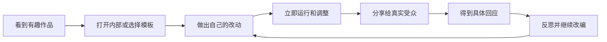

# 03｜Scratch：玩法、影响力与可借鉴之处

日期：2026-09-26。来源包括官网、基金会报告、当前 GitHub 仓库、帮助中心，以及本轮浏览器检查。没有发布测试作品或创建账户。

## 1. Scratch 是什么

Scratch 同时包含创作工具、可运行作品格式、作品社区和教育资源。它允许学生做互动故事、游戏、动画、艺术和音乐作品；“玩别人作品”和“查看内部并修改”之间距离很短。

**对你们而言，最值得借鉴的是作者—玩家—再创作者可以互相转换。** 不是要求每位学生一开始就学会编程，也不是只复制猫咪角色和积木外观。

## 2. 本轮实际界面检查

在未登录状态打开 [Scratch 编辑器](https://scratch.mit.edu/projects/editor/)，确认可见：

- Code、Costumes、Sounds 三个创作页签。
- 动作、外观、声音、事件、控制、侦测、运算、变量、自制积木分类。
- 舞台、角色位置/大小/方向、角色和背景选择、绘画和上传入口。
- 启动、停止、全屏和扩展入口。
- 教程分类：动画、艺术、音乐、游戏、故事。
- 教程示例：Pong、点击游戏、追逐游戏、故事、角色动画、想象世界、视频侦测、面部侦测、会说话的动画等。

这些属于界面观察，**没有逐项验证相机、硬件扩展、账号、分享和多人能力**。初次加载曾超时，随后成功；这只能说明当前环境的一次访问经历，不能作为全国可用性结论。

## 3. “有哪些玩法”：分成作品玩法与参与方式

### 3.1 作品玩法

| 类型 | 学生创作内容 | 玩家做什么 | 关键创作概念 | 对本项目的启发 |
|---|---|---|---|---|
| 迷宫/关卡/平台跳跃 | 路线、障碍、机关、出生点与终点 | 移动、试探、找路线 | 碰撞、条件、关卡状态 | 很适合“设计给别人玩”；先限定少量规则 |
| 追逐/躲避/Pong | 速度、边界、目标、计分 | 反应与控制 | 循环、事件、坐标 | 反馈快，但反应能力差异可能影响成就感 |
| 点击/收集/经营原型 | 点击对象、资源变化、解锁 | 点击、选择、探索 | 变量、资源规则 | 可做规则实验；不建议采用诱导久玩的数值循环 |
| 互动故事/冒险 | 人物、对话、分支结局 | 选择、探索、理解叙事 | 广播、切换场景、状态 | 不喜欢动作游戏的学生也可表达创意 |
| 动画/短片 | 造型、动作、节奏、对白 | 观看和回应 | 时间、序列、并行事件 | 贡献无需依赖复杂逻辑，适合小组分工 |
| 音乐/数字乐器 | 节奏、音色、交互按钮 | 演奏、混音 | 事件、循环、同步 | 扩大“创造力”的定义，提供不同优势入口 |
| 艺术/生成图案 | 画笔规则、颜色和变换 | 观看、调整参数 | 重复、随机、几何 | 能快速获得可见成果 |
| 模拟/可视化 | 生态、运动、简单实验 | 改参数、观察结果 | 变量、模型、因果假设 | 后期连接课程，避免首轮变成学科测验 |
| 感知/实体交互 | 摄像头或硬件输入驱动作品 | 通过动作或实物交互 | 输入输出、传感 | 需要额外设备、权限和课堂安排，非 MVP 必需 |

这张表是对工具能力的玩法归纳，不表示 Scratch 预装了完整的商业级平台跳跃/经营游戏制作器。用户通常还需要自己组合逻辑或改编模板。

### 3.2 社区参与方式

1. **浏览和玩：** 发现题材、欣赏别人的作品。
2. **查看内部：** 从效果走到实现，降低学习和修改的距离。
3. **改编：** 在原作基础上加入变化，并认可原作者贡献。
4. **分享与反馈：** 他人体验、评论、收藏或表达喜欢。
5. **工作室/主题活动：** 围绕某个主题汇集作品，形成共同创作氛围。
6. **教师组织：** 教师账户能创建学生账户、把作品组织到工作室并查看评论。[教师账户官方说明](https://www.scratchfoundation.org/learn/learning-library/teacher-accounts)

教师账户不是“已经确认有封闭班级空间”的保证。本轮没有验证其能满足中国学校对班级私密分享、数据保留和校内身份的全部要求；不能因为有教师管理功能，就把公开社区当学校私有系统。

## 4. 为什么它可能形成正反馈

我们对机制的分析：模板降低起点难度；即时运行缩短反馈周期；开放结局保留选择；真实受众增加作品意义；改编让新手既能借助他人又有原创空间。MIT 的创造性学习框架支持这种设计方向，但它不构成治疗结论。[MIT 创造性学习](https://www.media.mit.edu/posts/designing-activities/)

**可能的反效果：** 热门作品比较、低曝光、评论冲突、抄袭争议、复杂编辑器、成人过度指导。针对厌学者，建议保证每个作品至少得到一位同伴认真试玩，用“我注意到……”“我尝试了……”替代排行榜。

## 5. 影响力有多大：先对齐指标口径

| 官方口径 | 数值 | 时间/来源 | 不能据此声称什么 |
|---|---|---|---|
| 触达用户/儿童总量 | 2024 年超过 1.4 亿；当年新增 2,150 万 | 2024 年报 | 不是月活，也不是去重后的当前在校学生人数 |
| 累计创建项目 | 2024 年达到 10 亿+ | 同一年度报告 | 不等于 10 亿公开、有效、原创游戏 |
| 合作组织 | 229 个、覆盖 49 国；合作网络服务 400 万+青少年 | 2024 年报 | 不应与平台人数相加，可能重叠 |
| 当前官网募捐页自述 | 1.6 亿+用户、10 亿+项目、80 种语言 | 2026-09-26 页面快照，统计期未明确 | 不把营销页面数字当经审计实时统计 |
| 合作页自述月度使用 | 每月约 300 万青少年 | 当前合作页，方法未充分披露 | 不与“每月注册人数”混用 |

来源：[2024 年报](https://annualreport.scratchfoundation.org/)、[当前募捐页](https://www.scratchfoundation.org/donate)、[合作页](https://scratchfoundation.org/get-involved/partner-with-us)。当前 [影响力页面](https://www.scratchfoundation.org/impact) 另用 1.5 亿+等口径，说明官网不同页面更新不完全同步；本报告保留差异，没有拼成一个貌似精确的总数。

影响力的实质还包括：跨语言内容、教师课程与培训、改编文化、社区活动，以及大量兴趣导向作品。基金会关于快乐、表达和关系的调查值得参考，但主要反映参与者体验，不是对厌学人群的随机试验；也可能有活跃用户和自愿参与偏差。

## 6. 商业化与可持续性

Scratch 面向使用者保持免费，基金会采用非营利运营、捐赠、合作以及许可等方式支持发展。免费不等于没有服务器、审核、教育支持和研发成本，也不意味着可以无条件商用其品牌或素材。[基金会合作与许可说明](https://www.scratchfoundation.org/get-involved/partner-with-us)

对本项目可探索的是学校/机构为教师工具、课程和支持付费，而非对学生采用广告或内购。当前只是业务假设，还没有学校支付意愿证据。

## 7. 2026 年必须注意的源码和内容授权

### 7.1 源码

当前主仓库为 [scratchfoundation/scratch-editor](https://github.com/scratchfoundation/scratch-editor)，采用 monorepo 组织编辑器和播放器相关组件，许可证标注 **AGPL-3.0**。[许可证文件](https://github.com/scratchfoundation/scratch-editor/blob/develop/LICENSE)

采用、修改、分发或以网络服务提供 AGPL 代码，需要评估相应源码提供义务及组合边界。不能简单认定“用了一个 AGPL 包就整个公司全部代码必须公开”，也不能通过把服务放后台就假定没有义务。应在锁定具体版本、模块和交付方式后做许可评审。

### 7.2 品牌、素材和用户作品

2026-01-22 更新的 Scratch 服务条款区分源代码、Support Materials、品牌和用户内容。用户作品的站内改编授权不能被直接理解为允许拿到自己的商业平台任意复用；不能照搬旧文章中“所有共享作品一律 CC BY-SA”的说法覆盖当前条款。[当前服务条款第 7、8 节](https://mitscratch.freshdesk.com/en/support/solutions/articles/4000219182-scratch-terms-of-service)

对历史作品，还可能涉及发布时的许可证及不可撤销授权等问题，需要逐件保留证据。最省后续成本的做法是首版使用自制或许可证明确的素材，不把 Scratch 猫、Logo 和社区作品作为默认素材库。

### 7.3 官方站点与自行部署是两件事

开源编辑器并不意味着下载仓库即可获得与 scratch.mit.edu 完全相同的账号、社区、审核和运营服务。复制整个社区需要另行建设和维护；首版只需要一个受控的创作与分享循环。

## 8. 三种利用方式

| 路径 | 优点 | 代价/限制 | 适合阶段 |
|---|---|---|---|
| 使用现成 Scratch 做活动 | 几乎无需开发；模板和教学资源丰富 | 账号、联网、隐私、当前条款、操作门槛需核验 | 先验证创作与互玩活动 |
| 基于具体版本改造编辑器 | 能复用完整创作能力和作品生态 | AGPL、升级、模块耦合、素材/品牌授权和社区后端 | 需求明确且接受相关授权义务时 |
| 自研窄范围关卡工具 | 操作更少，可定制班级反馈和本地存储 | 编辑器、撤销、试玩和存档都要自己做 | 证明现有工具不足后，开发差异化 MVP |

**建议顺序：** 纸面/现成工具活动 → 观察真实障碍 → 自研最小关卡创作器。先确认孩子需要什么，再决定要不要做一个更大的 Scratch。
