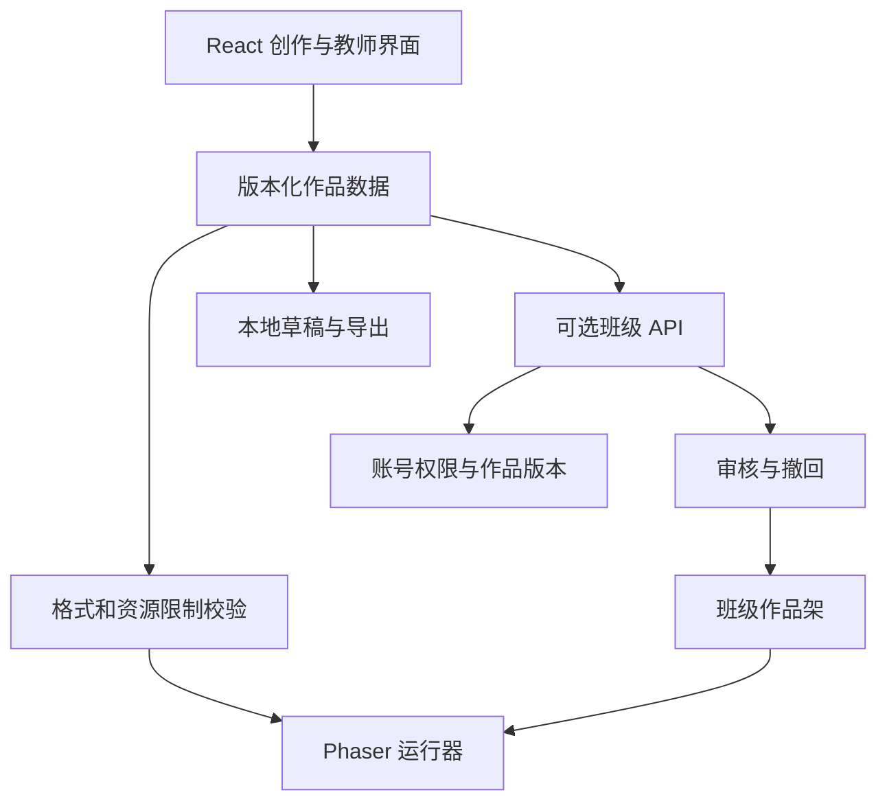

# 05｜技术选型、开发和部署建议

日期：2026-09-26。状态：建议，未实现。本章按 12–15 岁、教师带领、二维关卡、非医疗用途估算；未来正式发行需满足 [04](04-china-release.md) 的前置条件。

## 1. 先定义首版要验证的体验

学生能在一次活动内完成：选择一个可玩模板 → 改造路线或机关 → 自己试玩 → 让同伴体验 → 收到一条具体反馈 → 再修改一次。

首版成功标准是学生能自主完成这个循环，教师能组织；功能数量、在线时长和 AI 生成量都不是首要目标。

### 建议的 MVP 范围

- 一个俯视二维网格关卡类型；首版不同时做横版跳跃、三维沙盒和叙事编辑器。
- 五至八种易懂组件，例如起点、终点、墙、钥匙、门、开关、可移动物体。
- 拖放、属性修改、撤销/重做、自动保存、恢复上次作品。
- 可玩的完整模板和不同难度的半成品；学生不必从空白画布开始。
- 编辑/试玩快速切换；失败重来无惩罚；可一键恢复模板副本。
- 本地导入/导出作品；教师主持同伴互玩，后续才增加网络作品架。
- 作品作者、基于哪个版本改编、修改说明；评论先用结构化反馈。
- 大按钮、键盘与触控支持、文字和符号双重提示、不只靠颜色表达状态。

首阶段暂不安排开放注册、陌生人社区、私信、商城、排行榜、任意代码、任意素材上传或生成式 AI。这是基于验证目标的范围建议，不是永久禁止这些能力。

## 2. 框架比较

| 方案 | 优点 | 主要代价 | 适用判断 |
|---|---|---|---|
| 现成 Scratch + 活动设计 | 开发投入最少、内容丰富 | 不能完全控制产品门槛、数据和社区；当前授权需核验 | 先验证活动是否吸引目标学生 |
| 自研 Web：TypeScript + Phaser | 二维玩法、UI和编辑器集成方便；桌面和平板浏览器可用 | 自己做创作器、状态和安全运行；移动适配需实测 | **本项目自研首选** |
| Scratch 编辑器二次开发 | 拥有成熟积木创作能力 | AGPL、复杂模块、升级、社区后端、品牌和素材授权 | 只有明确需要完整编程环境时再选 |
| Godot | 独立游戏编辑器成熟，可做二维/三维和桌面程序 | Web 导出依赖 WebAssembly/WebGL2；DOM式编辑器和网页管理台集成成本 | 若离线桌面或三维玩法成为核心，则重新比较 |
| Cocos Creator | 国内小游戏导出生态值得评估 | 平台适配、引擎许可和版本需核验；网页创作器仍需自己建 | 确定微信/抖音等小游戏为主渠道后做专项 PoC |
| Unity | 三维表现、游戏制作与生态较完整 | 包体、网页嵌入、学校设备、授权及运维复杂度更高 | 当前窄范围二维验证不优先 |

官方依据：[Phaser 仓库](https://github.com/phaserjs/phaser)、[Godot Web 导出](https://docs.godotengine.org/en/stable/tutorials/export/exporting_for_web.html)、[Unity Web 文档](https://docs.unity3d.com/Manual/webgl-intro.html)、[Scratch 主仓库](https://github.com/scratchfoundation/scratch-editor)。Cocos 的具体导出版本和渠道支持仍需原型验证，本轮未成功抓取所访问的导出说明页，因此不承诺一键跨平台。

**版本选择：** 当前 Phaser 主仓库已展示 4.x 文档及示例，不能照抄老教程默认选 3.x。开发时先用实际目标浏览器做 1–2 天兼容性试验，再锁定确切版本与依赖文件；不让构建长期跟随 `latest`。其当前代码许可证为 MIT，但素材和第三方依赖另行核查。

## 3. 建议技术组合

| 层次 | 选择建议 | 原因 |
|---|---|---|
| 语言 | TypeScript | 编辑器、运行器与服务端共享类型和作品格式 |
| 界面 | React | 素材面板、属性、保存状态、教师界面等普通应用 UI |
| 构建 | Vite | 本地开发和静态打包；对照当前 Node 版本要求 |
| 游戏运行/画布 | Phaser | 处理场景、输入、二维渲染、碰撞及动画 |
| 首版逻辑编辑 | 拖放 + 有限属性与事件表 | 比完整编程积木更容易验证低门槛体验 |
| 后续积木 | Blockly（需要后再加） | 只承担可视化编辑；执行语义和安全边界由项目定义 |
| 本地持久化 | IndexedDB + 显式导出文件 | 离线草稿、版本恢复；不能把浏览器存储视为永久备份 |
| 班级 API | Node 受维护 LTS + Fastify | 简单 REST API、校验、账号与作品权限 |
| 单校试点数据库 | 单实例 SQLite，事务性写入；若多人/多实例需求明确则 PostgreSQL | 起步简洁；不要在网络共享盘上粗暴共享 SQLite 文件 |
| 多校/云端 | PostgreSQL + 对象存储 + 备份 | 组织隔离、迁移、媒体和归档按服务边界管理 |
| 测试 | Vitest + Playwright，重点测试行为和数据完整性 | 作品回放、存档迁移、权限和课堂主流程 |
| 部署 | 静态资源 + 可选 API；后期 Docker Compose + Caddy/Nginx | 单机试点足够清楚，暂不需要 Kubernetes |

框架依据：[Vite](https://vite.dev/guide/)、[Fastify](https://fastify.dev/docs/latest/)、[Blockly](https://docs.blockly.com/guides/get-started/what-is-blockly/)。以上组合是设计选择，不是已经进行过性能验证的结论。

Blockly 是可嵌入的积木编辑库，不提供现成的完整 Scratch 社区，也不自动提供安全脚本执行沙箱。首版即使不用积木，仍然可以培养规则设计和创造力。

## 4. 让编辑器与运行器分离



游戏运行不依赖每帧请求服务器；服务器负责作品、权限和活动状态。编辑数据与运行时状态分开，避免试玩后把角色位置、计分等临时状态写坏作者的原始关卡。

### 作品格式建议

下面是概念示例，尚不是已确认的接口契约：

```json
{
  "schemaVersion": 1,
  "projectId": "local-project-id",
  "title": "两条路都能到达",
  "templateId": "maze-starter",
  "parentVersionId": null,
  "level": {
    "width": 20,
    "height": 15,
    "objects": [
      {"id": "start-1", "type": "spawn", "x": 1, "y": 1},
      {"id": "goal-1", "type": "goal", "x": 18, "y": 13}
    ]
  },
  "rules": [],
  "assetRefs": ["builtin:tiles/basic-v1"],
  "creatorNote": "我想让玩家自己选路线"
}
```

班级身份、审核状态与访问控制放在服务端记录里，不能信任导入文件自称“已审核”或“老师创建”。作者声明、分享授权与派生关系也应区分保存。

## 5. UGC 的执行边界

1. 关卡是声明式 JSON，不允许 `eval`、任意 JavaScript、HTML 或任意网络请求。
2. 每种对象、事件和动作有白名单；加载时和提交时都校验版本、坐标、数量和资源大小。
3. 规则执行设置每帧/每次任务预算、事件队列上限、递归/循环限制和可强制停止机制。
4. 对图片、声音和压缩包设置体积/尺寸/解压配额；首版采用内置素材即可避免大部分上传面。
5. 后续引入可执行逻辑时，采用受限解释器/Worker 等隔离，并审查网络与资源权限；单纯放进 Worker 不等于安全隔离完成。
6. 发布的是不可变作品版本；修改产生新版本。审核通过的版本不被后续草稿覆盖。
7. 服务端检查组织、班级、作者与审核权限，不能只靠前端隐藏按钮。

这些能力是保护同伴设备和课堂秩序的实际需求，不能等到社区开放后再补。

## 6. 三种部署模式

### A. 离线/单设备活动：先做

打包所有脚本、字体和素材，使用本地静态服务器或合适的桌面封装；作品保存在本地，教师通过文件交换组织互玩。避免依赖海外 CDN、在线字体和外部登录。

PWA 可帮助缓存，但不是自动“离线永不丢数据”：首次加载、更新、缓存淘汰和浏览器清理都要测试；提供显式导出和教师备份。Service Worker 通常需要 HTTPS，`localhost` 属于受信任例外；局域网 `http://192.168.x.x` 不能被想当然地当成同样可用。[Service Worker 文档](https://developer.mozilla.org/en-US/docs/Web/API/Service_Worker_API)

直接双击 `index.html` 的 `file://` 方案也可能受到资源加载和浏览器限制；应选一种能在学校机器上稳定启动的交付方式并实测。

### B. 校内局域网班级服务：第二步

使用学校批准的电脑/服务器提供资源和 API；班级内学生用浏览器访问，教师统一开始/暂停活动并审核分享。配置被客户端信任的 HTTPS、最小权限账号和局域网访问策略；不要求学生自行跳过证书警告。

教师准备作品包、备份和活动名单；断网时能继续编辑并导出，恢复后用版本号处理上传冲突。学校校园网可能隔离终端，部署前需要网络管理员确认互访策略。

**家里的 i7-11700 不在学校局域网内。** 不应把学生课堂依赖建立在家庭宽带、个人代理或个人电脑在线状态上。可在家里构建，交付到校内批准的机器。

### C. 公网正式服务：明确发行路线以后

国内合规云资源、域名/备案、HTTPS、API与数据库隔离、对象存储、监控、备份和恢复流程；若按游戏发行，再加相应出版、实名、防沉迷与渠道接入。

先用一个应用实例和数据库，按实际瓶颈扩展。公开 UGC 后，审核与客服可能比计算成本更早成为瓶颈；不能用“服务器很便宜”推算运营成本。

## 7. i7-11700 与 Mac 的分工

此前已检查到：Linux 为 i7-11700、8 核/16 线程、64 GB 内存、约 1 TB SSD、无独立 NVIDIA GPU；Mac 为 M3 Pro、36 GB 统一内存。这些为本任务此前观测，非本轮压力测试结果。

| 设备 | 适合做什么 |
|---|---|
| Mac | 交互开发、设计、浏览器和 iPad/Safari 调试、本地预览 |
| i7-11700 | Git 工作区、Linux x86 构建、测试、容器、班级服务模拟、数据库与定期备份 |
| 学校现场设备 | 学生实际运行、受控试点与离线备用 |
| 合规云环境 | 后期正式对外服务，独立账号与正式运维责任 |

二维画面主要在学生浏览器端运行，Linux 服务器不需要替每个学生实时渲染。20–40 人班级对元数据 API 可能是很轻的负载，但同时打开资源、自动保存、并发提交和图片上传仍需压测，不能仅凭 CPU 型号保证容量。

开发服务可以只监听 Linux 回环地址，通过 SSH 转发给 Mac 调试。例如服务实际启动在 4173 端口后再使用：

```sh
ssh -L 4173:127.0.0.1:4173 cloudray@192.168.1.222
```

这只是拟议调试方式，本轮没有启动服务器或改防火墙；不把 SSH 密码放入项目文档。

## 8. 建议开发顺序与估算

以下是小团队规划区间，不是报价，也未包含机构招募、审批等待和临床研究。

| 阶段 | 输出 | 粗估 | 验收重点 |
|---|---|---|---|
| 0. 访谈和活动验证 | 纸面/现成工具工作坊、障碍记录、年龄与场景确认 | 1–2 周 | 是创作、同伴受众还是奖励在吸引学生 |
| 1. 技术探针 | 目标设备上编辑/运行/保存、版本与许可清单 | 2–4 个工作日 | 网络断开、触控、学校浏览器、旧电脑性能 |
| 2. 离线创作闭环 | 一个关卡类型、模板、撤销、试玩、导出 | 2–4 周 | 从模板到独立完成；不会丢作品 |
| 3. 受控试点工具 | 教师活动脚本、作品架或文件交换、反馈 | 2–4 周 | 每人得到公平反馈、教师能维护秩序 |
| 4. 公开服务准备 | 渠道、审核、身份、数据和运营体系 | 另立项目估算 | 不是给 MVP 套壳就自动完成发行 |

人力假设：1–2 名开发者、持续参与的教育伙伴、必要的美术/体验支持。若只有一位兼职开发者、目标设备未知或需重做底层编辑器，工期会更长。

## 9. 只做与风险对应的验证

- 作品序列化/反序列化、版本迁移，导出后能在另一设备恢复。
- 撤销/重做与试玩隔离，不因浏览器关闭或切换模式破坏作品。
- 非法关卡、超大输入、循环规则不会冻结课堂设备。
- 教师、学生、其他班级之间的权限检查；被撤回作品不能继续经 API获取。
- 编辑→试玩→分享→反馈→修改的真实浏览器流程，覆盖键盘和触控。
- 离线资源、服务升级和备份恢复；至少完成一次从备份恢复的演练。
- 扩展班级服务时，模拟预期并发而不是追求无意义的极限吞吐分数。

## 10. 什么时候重新选型

如果多数目标学生更想讲故事，应优先改变作品类型而非继续堆关卡组件；若需要真实三维探索，重新比较 Godot/Unity；若主要渠道确定为小游戏，重新评估 Cocos 与平台 SDK；若教师已经能用现成 Scratch 达成目标，就先投入活动和服务，而不是为了自研而自研。
