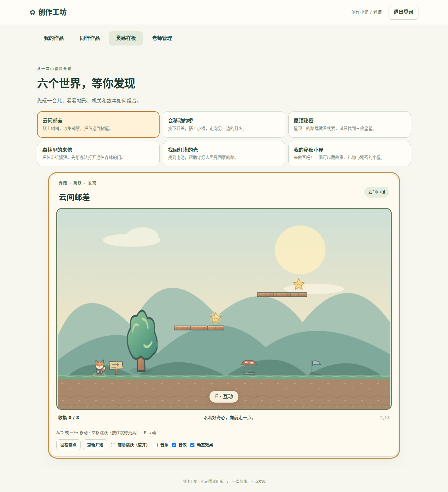
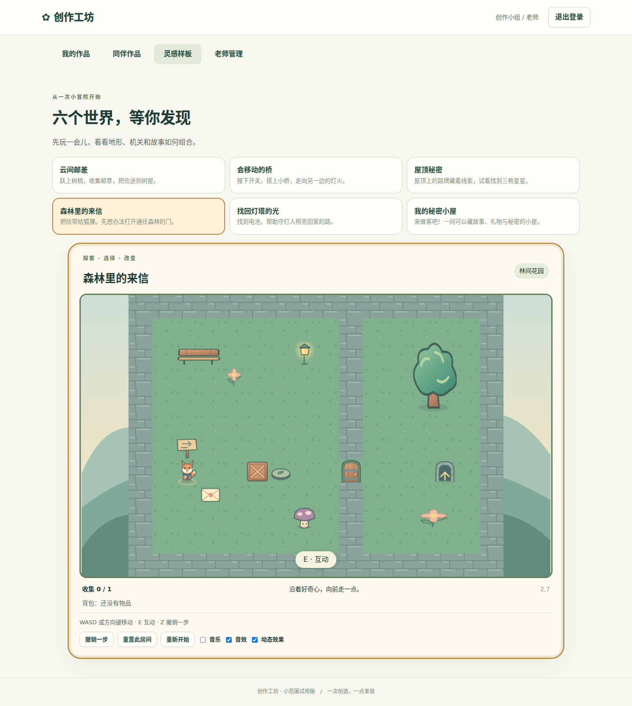

# M2 样板冻结证据

日期：2026-09-27。仅冻结两玩法样板基础；整体接管门槛未达到，M3–M6继续。

## 实现
- V2严格文档、6个模板；横版固定步长运动/机关/检查点；探索箱子/背包/对话/跨房间/撤销。
- 39项原创SVG绘本素材，Phaser画布，React界面；两种原创新编合成音乐及音效。
- 灵感样板入口使用正式运行器。V1现有编辑、审核、分享、播放未替换。
- 键盘鼠标优先，失焦/弹窗输入隔离、预加载就绪保护、销毁音频/画布。

## 验证命令及结果
均在11700仓库执行，数据库为内存或E2E临时目录。
- `npm run typecheck`：退出0。
- `npm run test:coverage`：76项UT通过（含3项Chromium直接组件/运行器UT）；全src报告、原server+shared四项70%和backend四项70%保持。
- baseline `82c1c2d48ddc79b33f0a6e6fef7e6a29e47d1510`；新增可执行行覆盖758/804=94.28%，没有并入E2E覆盖。未覆盖行由门禁逐文件输出。
- backend行/语句/函数/分支：90.48% / 89.21% / 89.23% / 87.57%。
- `npx playwright test`：5条真实Chromium E2E通过：云间邮差跳跃/开门/通关；森林取信/推箱开门/传送/交付/结局/撤销；3条旧平台全链路与草稿/权限回归。
- `git diff --check`：退出0；构建成功。Phaser延迟chunk约329KiB gzip，初始登录包不载入引擎。
- src/tests/public文件哈希清单再汇总SHA256：`9781c409a6ba489b83825477a94ea334bee1d3c6b376c16c02359d0cf73aa25c`。

## 独立只读复查
- m2_rules_review_a/b：ID/对话/重置/物品、平台/挤压/弹簧/检查点/计时门，10项回归先失败再修复。
- m2_rule_fix_review：更快上升平台与上升角色相对接触、安全检查点位置，2项回归先失败再修复。
- m2_runtime_review：动态加载点击、暂停待执行按键、异步音频销毁；均先失败再修复；明确两玩法弹窗均屏蔽游戏快捷键。
- m2_freeze_review：补素材preload窗口就绪保护后，无未处理Blocker/Important，无需增加服务或通用引擎抽象。
- m2_gate_audit：22/22源文件报告完整，全部9个变更业务文件计入增量分母；69%失败、70%通过、缺文件失败；Minor未覆盖行报告已补。

## 视觉检查
初次截图发现SVG缺尺寸导致裁切，补显式width/height后重跑检查；两种样板角色、地形、机关与房间布局可辨。

## 明确未完成
新关卡编辑/服务器存取/审核分享在M3/M4；个人图片、涂鸦、角色颜色配件、反馈定位、改编及素材导出在M5；部署和全需求验收在M6。首次框架需加载Phaser，缓存后重复使用。声音生命周期和音调调度已测试，未声称已在用户扬声器实听。真实学生体验/教育效果尚无现场数据。生产仍为之前M1 release，未部署M2。
