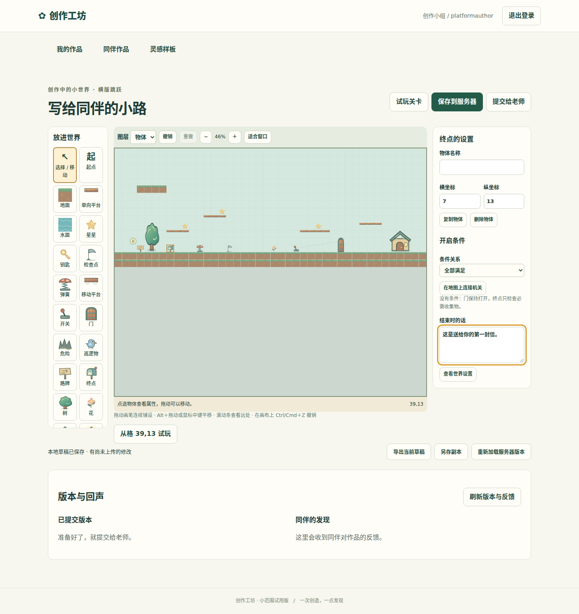
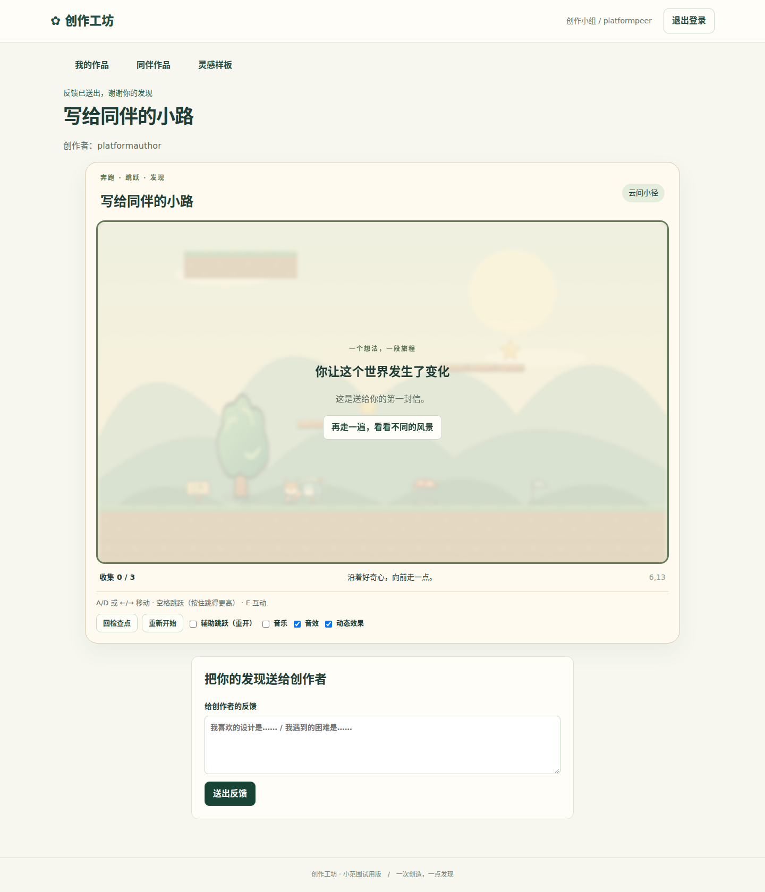

# M3 横版创作冻结证据

日期2026-09-27；冻结范围为C31–C34和S3.1–S3.4。整体目标继续M4–M6，生产尚未切换。

## 实现
统一V1/V2校验与原平台API，保留旧编辑/游戏；新横版编辑器支持分层拖画、选择移动复制、保护引用的删除、历史、地图大小、内置角色/主题/音乐、文字、路线与机关可视连线。从模板创作、原位试玩返回、指定点击格试玩、保存/离线恢复/导出导入、提交审核及同伴反馈使用同一平台。
请求期间禁止继续绘图，损坏本地记录保留完整raw并提供导出；大地图导出使用与导入同样的紧凑容量约束。

## 当前验证证据
环境：11700、Node22.22.1、Chromium真实浏览器；UT内存/独立临时DB，未访问生产数据。
代码基线main `c44109e4f0727ab6625e010944f4aa24f9e7db8c`，feature/m3-platform-editor工作树；src/tests/public文件内容哈希清单汇总SHA256：`f3fe483acc74e2d3aec9d8098a4737437607d92ea21c23310722fe2b42fc00b6`。
- `npm run typecheck`、E2E内执行`npm run build`退出0。
- `npm run test:coverage`：103 UT /19文件通过；M3新增可执行行317/374=84.76%（基线c44109e），整个双玩法工作基线82c1c2d的覆盖率另见进展记录。浏览器组件/运行器UT直接挂载，不计E2E命中。
- backend行/语句/函数/分支90.48%/89.21%/89.23%/87.57%；server+shared原四项均>91%。
- `npm run test:e2e`完整7项通过；最后两项UI修复后重跑受影响的`npx playwright test tests/e2e/editor.spec.ts`，2项通过。其他5项不使用新NumberInput/previewCell，旧证据保留有效。
- 横版真实流程：学生拖画、改目标/结束文字、从起点及指定点击格通关、返回保留选择/缩放、延迟保存时画布锁定、提交→老师展示→另一学生通关反馈；改稿后已展示内容不变；离线恢复、冲突保留、JSON往返。
- `npm run format:check`及`git diff --check`通过。Phaser延迟包尺寸警告、Vitest Vite兼容hook告警不影响上述验证，不为消警告引入额外架构。

## 独立只读review与闭环
- m3_editor_core_review：矩形占格、路线副本、指定起点校验、引用稳定、草稿标记、序列化容量；均修复并以UT/E2E验证。
- m3_editor_ui_review：请求中SVG继续编辑、falsey损坏草稿、越界拖动钳制、玩法标识；前三项先失败后修复，标识已显示。
- m3_final_core_review：原范围及修复未发现Blocker/Important，无明显过度设计。
- m3_final_ui_review：最后发现悬停改变指定试玩格、逐字修改数字受阻；新增失败组件测试后以独立previewCell和提交式数字输入修复，8编辑组件UT及真实鼠标指定位置E2E通过。无未处理Blocker/Important；本轮Minor均修复。
仍复用React/Phaser、单Fastify/SQLite；没有新增服务、表、通用规则引擎。

## 图形结果
截图为临时E2E账号及虚构内容。

## 限制与后续
故事房间/对话编辑M4；个人素材/配件颜色/改编/定位反馈M5；部署与全范围/恢复验收M6。未宣称课堂有效性、学生体验或用户扬声器实听。原登录10次/分钟同IP限制在连续测试中确实触发，E2E复用老师真实登录会话而不关闭限流；M6需评估课堂共同出口的集中登录容量。异机备份仍延期。
