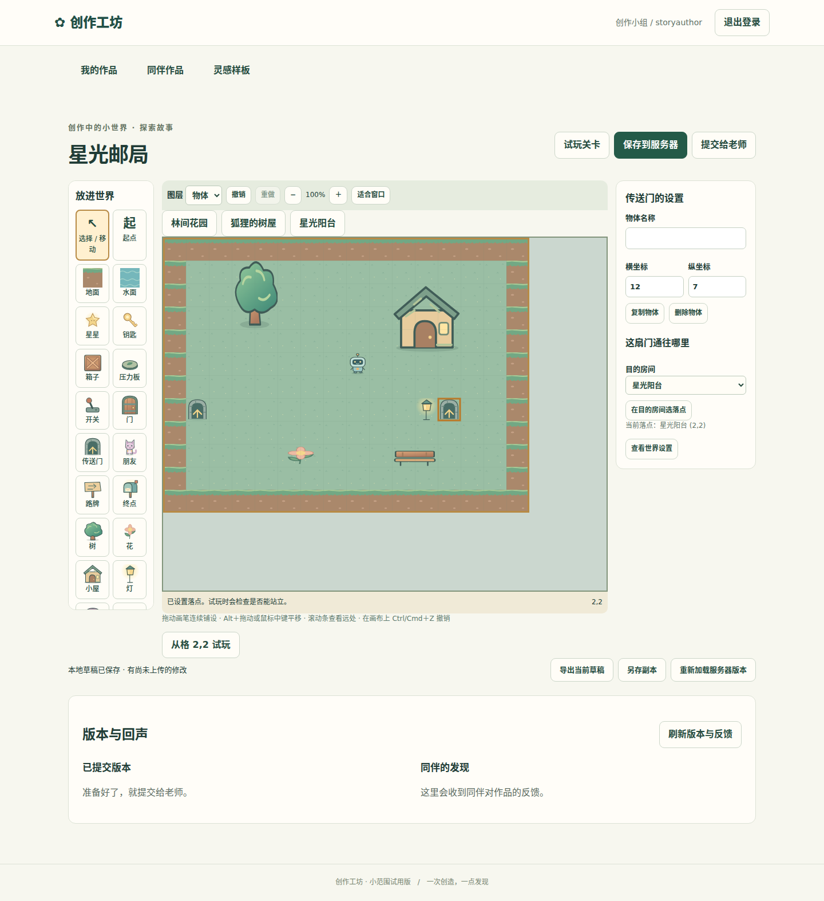
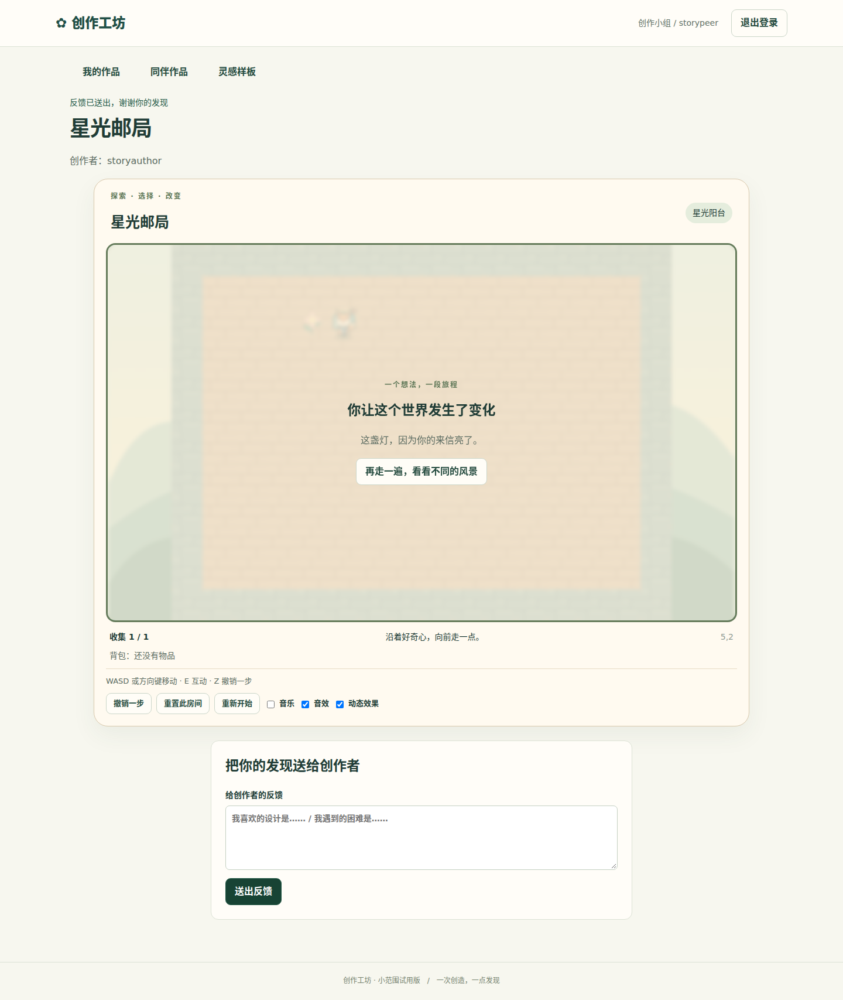

# M4 探索故事创作冻结证据

日期2026-09-27；C41–C44、S4.1–S4.3，基线main41e5505e7abbc5540be41b51f9bb7bc24380e33f。当前feature/m4-story-editor工作树src/tests/public按路径＋NUL＋内容＋NUL排序累计SHA256：fd3df57b61c4a1a5c849034283b0c1bf4ce4981f98513206ee46738992366b41。

## 交付范围
1–6房间的添加、改名、地板/尺寸、删除引用保护和撤销；地图点选门户目的地；人物对话卡片的条件、顺序、页间选择、交付/获得物品、任务标记和结局；任一/全部条件以可读房间/物体名称显示；标记改名/删除原子更新引用。三故事模板均可创建，复用草稿/版本/老师审核/同伴反馈。没有新增服务、数据库表或通用脚本。

## 验证
环境11700、Node22.22.1、真实Chromium；独立临时DB，不操作生产数据。
- 核心操作测试先缺模块red，再8项green；M3数字输入与画布衔接先red（地图宽度50被覆盖为42）后修复。
- 独立review两项回归先red：删除房间提示漏起点；坐标编辑失焦后立即拖动仍按旧位置hit（预期26实际25）。两项修复后green。
- 最新`npm run test:coverage`：119 UT /21文件通过；M4增量264/273=96.70%，UT包括直接Chromium组件测试，不含E2E覆盖。
- Backend行/语句/函数/分支90.48%/89.21%/89.23%/87.57%，server+shared四项均≥92%。
- `npm run typecheck`、E2E内`npm run build`、`git diff --check`退出0。
- 最终代码上`npm run test:e2e`完整8项通过（48.4秒），含2样板、2横版编辑、1故事编辑、3旧流程回归。
- 故事真实流程：作者新增第三房间/换地板/改人物对话和外形/配置任务标记结局/地图选传送落点→普通键盘动作预览通关→保存提交→老师确认→另一学生取信、推箱、交信、跨房间通关→反馈→作者看到反馈。未注入运行状态跳过游戏。
- 已目视检查编辑及完成截图；纸片绘本样式一致，地图/属性/结局可见。测试定位地板选项最初因exact label包含option文本失败，修正选择器后通过；未改产品语义以适配测试。
- `npm run format:check`与`git diff --check`退出0。既有Phaser延迟包尺寸、Vitest Vite hook警告继续记录，不影响构建/运行结果。

## 独立复查
m4_story_core_review：核心引用与编辑操作无有效问题。
m4_ui_contract_review：删除提示起点和旧hit闭包两项已按失败回归修复。
m4_final_review：发现默认装饰缺图和对话条件缺地图点选。新增失败回归后统一默认装饰为tree、复用点选/连线设置对话条件；5故事组件UT及双玩法纹理回归已通过。m4_last_review独立复查原M4范围及修复，未发现新增Blocker/Important或明显过度设计。所有本轮有效问题已关闭；仅M4冻结。

## 图形证据

## 边界
M5个人素材/角色配色配件/反馈定位/可选改编、M6部署恢复和全范围审计仍待完成；生产仍旧版本。电脑键鼠为主，真实学生体验和教育效果尚无现场证据。
